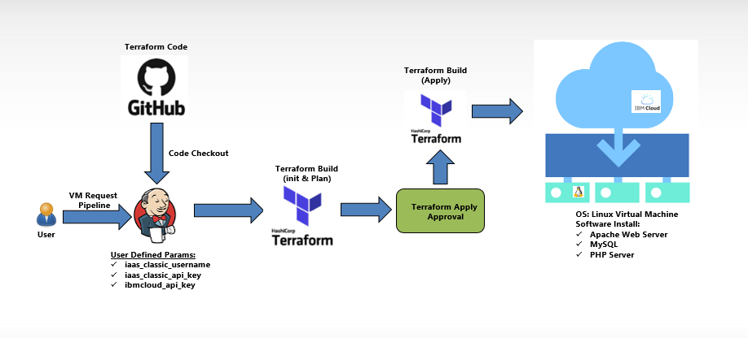

# Submission name

A basic GitHub repository example for Call for Code submissions and those projects that join the Code and Response initiative. Not all sections or files are required. You can make this as simple or as in-depth as you need.

## Short description

Desktop as a Service: Given the Covid19 situation there are two problems we see to be converted to potential opportunities. 

### What's the problem?

With Covid19 situation Companies need to rollout the Virtual Machines  to Associate who don’t Company Device to connect and security is concern for the company

### How can technology help?

The need towards Work-from-Home/Work-from-Anywhere model than the traditional way.
Faster on boarding of associates and making them productive immediately. Avoid delay or overhead involved with Procurement/Software-Installation/Access-privilege.

### The idea

Desktop as a Service: Given the Covid19 situation there are two problems we see to be converted to potential opportunities. 
1.	The need towards Work-from-Home/Work-from-Anywhere model than the traditional way.
2.	Faster on boarding of associates and making them productive immediately. Avoid delay or overhead involved with Procurement/Software-Installation/Access-privilege.
Roll out IBM virtual machine using terraform..

## Demo video

NA

## The architecture

## Long description

Potential Benefit
Time saving in associate onboarding by Rollout the VM within in span of few minutes with customize configuration
Eliminate overhead cost associated with manual process of software installation and associated tools
Eliminate the process overhead in request/approval of software and tools
Help the associate to be productive from day 1.
Access privileges, Dev environment setup, and Configuration eliminate overhead cost and saves time from manual setup 
Forecast Savings
Manual work for Infrastructure team will be removed with the click of button. 

## Project roadmap

## Getting started

Terraform script driven rolling out the Virtual Machine with default user.
Script will be run via CI/CD tools eg. Jenkins if approval process is need for apply. 
The required software will be installed on the fly
Access privilege to be granted along with DaaS provisioning
Dev Environment creation and configuration to be made immediately helping the associate to start working & productive immediately

### Prerequisites

Should have IBM account to install the terraform scripts

### Installing

Run the terrafom scripts in cloud CLI to create VMs and inrequired softwares.

## Live demo

NA

## Built with

Terraforms
